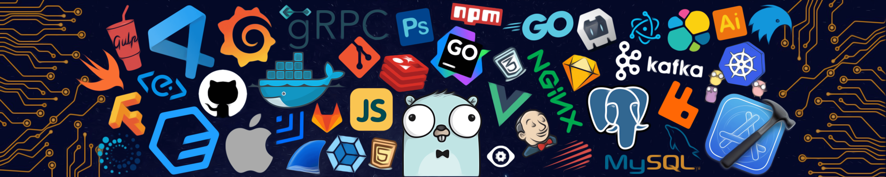

<p align="center">
  
</p>

<h1 align="center">Hi 👋 I'm Dmitry</h1>
<p align="center"><b><code>Python Backend Developer</code></b> &nbsp;·&nbsp; <b><code>AI / LLM Engineer</code></b></p>

<p align="left">
I build backends and slowly move toward AI engineering.<br/>
Currently doing my Master's and researching multi-agent LLM systems with long-term memory — both my thesis and something I genuinely find fascinating.<br/><br/>
Introvert who loves travelling and exploring the world — the gym and good movies for the days in between.<br/>
No alcohol, no smoking. Tea — always 🍵<br/><br/>
The best way to predict the future is to build it. ~
</p>

<p align="left">
  <a href="https://instagram.com/dimytoday" target="_blank">
    
  </a>
  <a href="https://twitch.tv/dimytoday" target="_blank">
    
  </a>
  <a href="https://youtube.com/@dimytoday" target="_blank">
    
  </a>
  <a href="https://t.me/dimytoday" target="_blank">
    
  </a>
  <a href="https://twitter.com/dimytoday" target="_blank">
    
  </a>
</p>

#

## 👨‍💻 About me

```python
class Dmitry:

    role       = "Python Backend Developer"

    education  = {
        "degree": "Master's in Software Engineering",
        "period": "2025 – 2027",
        "thesis": "Multi-agent LLM systems with long-term memory",
    }

    interests  = ["Backend Architecture", "AI / LLM Engineering", "High-load Systems"]
    available  = True   # open to remote & relocation
    tea        = "always 🍵"
```

- 🎓 **Bachelor's in Computer Science** · pursuing **Master's in Software Engineering**
- 🔬 Researching **multi-agent LLM architectures** with persistent vector memory
- 🚀 Aiming for backend / AI engineering roles at top-tier product companies
- 🌍 **English C1** · open to relocation · remote-friendly

#

## 🛠 Tech Stack

### ⚙️ Backend


### 🗄️ Databases & Caching


### 🤖 AI / ML


### 🏗️ Infrastructure


#

## 🚀 Featured Projects

<table>
<tr>
<td width="50%" valign="top">

### 💎 Aurum Jewelry


Full-stack luxury jewelry store: a single React app powering both the customer storefront and a full admin atelier, over an async FastAPI API. Multi-currency with live FX rates, Stripe checkout and Cloudinary imagery.


[](https://github.com/dimytoday/aurum-jewelry)

</td>
<td width="50%" valign="top">

### ✈️ Aviation Weather Assistant


REST API: fetches live METAR/TAF reports and translates raw aviation codes into plain English via LLM. Returns flight condition assessment (VFR/IFR).


[](https://github.com/dimytoday/aviation-weather-assistant)

</td>
</tr>

<tr>
<td width="50%" valign="top">

### 🧳 Voyager


Full-stack service that turns a trip form into a downloadable PDF travel report (weather, attractions, budget & tips). Generated asynchronously by a Celery chord — parallel weather + AI content feeding a PDF task — with live WebSocket progress.


[](https://github.com/dimytoday/voyager)

</td>
<td width="50%" valign="top">
</td>
</tr>
</table>

#

## 📊 GitHub Stats

<p align="center">
  
</p>
